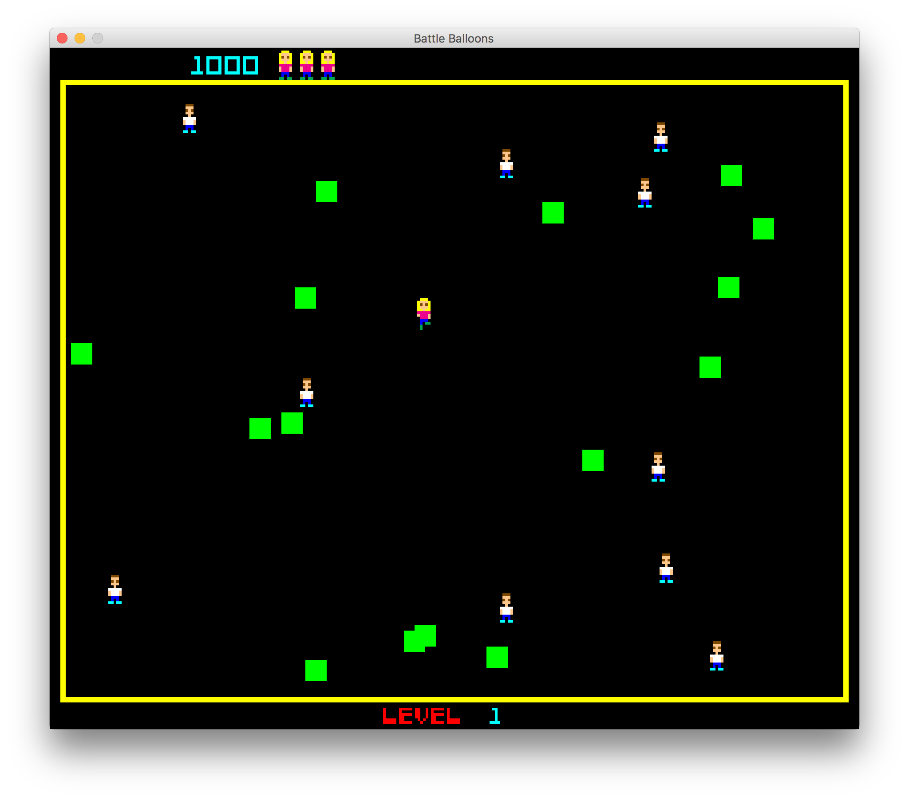

# Battle Balloons Course

This repo accompanies the Battle Balloons Java programming course for kids.

To run the game:

    $ ./gradlew run

## Technical

See http://www.seanriddle.com/willhard.html

- Colors: 256
  - 3 bits red, 3 bits green, 2 bits blue
  - 16 on screen at once
- Resolution:
  - 304 x 256
  - 4 bits per pixel
