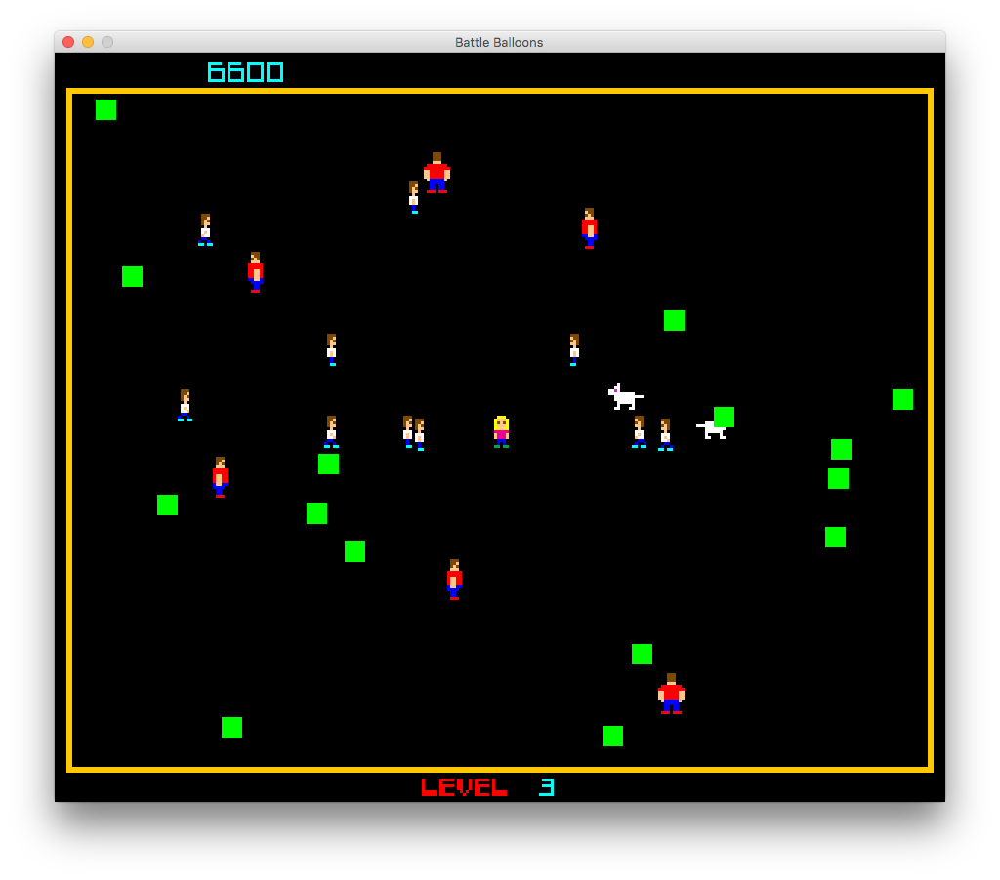

**NOTE:** Blog posts forthcoming for each of the following sessions. See https://progtuts.com/.

# Course overview

We will introduce participants to the elements of Java programming and create a video game called Battle Balloons. No
previous programming experience is required.

| Week | Topic | Download | Course Blog | Dev Blog |
| ---- | ----- | -------- | ----------- | -------- |
| 1 | Creating a player | [zip](https://github.com/williewheeler/battle-balloons-course/archive/week01.zip) | [Course Blog](https://medium.com/programming-for-kids/battle-balloons-week-1-8f0674656950) | [Dev Blog](https://progtuts.com/post/retro-lores-games-with-java2d/) |
| 2 | Moving the player | [zip](https://github.com/williewheeler/battle-balloons-course/archive/week02.zip) | [Course Blog](https://medium.com/programming-for-kids/battle-balloons-week-2-77566fc00577) | |
| 3 | Animating the player | [zip](https://github.com/williewheeler/battle-balloons-course/archive/week03.zip) | [Course Blog](https://medium.com/programming-for-kids/battle-balloons-week-3-4f7675554ae6) | |
| 4 | Adding obstacles | [zip](https://github.com/williewheeler/battle-balloons-course/archive/week04.zip) | [Course Blog](https://medium.com/programming-for-kids/battle-balloons-week-4-bb45bcce9e42) | |
| 5 | Colliding with obstacles | [zip](https://github.com/williewheeler/battle-balloons-course/archive/week05.zip) | [Course Blog](https://medium.com/programming-for-kids/battle-balloons-week-5-8240e74fb14d) | |
| 6 | Adding enemies | [zip](https://github.com/williewheeler/battle-balloons-course/archive/week06.zip) | [Course Blog](https://medium.com/programming-for-kids/battle-balloons-week-6-33d08e8dcba3) | |
| 7 | Making enemies move around | [zip](https://github.com/williewheeler/battle-balloons-course/archive/week07.zip) | [Course Blog](https://medium.com/programming-for-kids/battle-balloons-week-7-e946e548d539) | |
| 8 | Allowing player to throw balloons at enemies | [zip](https://github.com/williewheeler/battle-balloons-course/archive/week08.zip) | [Course Blog](https://medium.com/programming-for-kids/battle-balloons-week-8-767b054a5723) | |
| 9 | Adding sound effects | [zip](https://github.com/williewheeler/battle-balloons-course/archive/week09.zip) | | |
| 10 | Animation finishing touches | [zip](https://github.com/williewheeler/battle-balloons-course/archive/week10.zip) | | [Dev Blog](https://progtuts.com/post/sprite-spaghettification/) |

# Extra course content

Here are some extra weeks in case you get bored.

| Week | Topic | Download | Course Blog | Dev Blog |
| ---- | ----- | -------- | ----------- | -------- |
| 11 | Adding a title screen | | | |
| 12 | Adding a backstory screen | | | |
| 13 | Adding a roster screen | | | [Dev Blog](https://progtuts.com/post/blinking-as-a-random-variable/) |

# Running the game

    $ ./gradlew run

# Playing the game

Move using TFGH, and fire using the arrow keys.

Note that I'd like to use WASD for movement, but there's currently a JDK bug that prevents this:

- https://stackoverflow.com/questions/43192166/on-mac-in-java-keypressed-event-doesnt-fire-for-certain-keys/43960171

# Acknowledgments

Thanks to:

- Ian McCunn for co-teaching the first [CoderDojo](https://coderdojo.com/) course based on this game.
- Our student BoomGoesBoom for contributing the zombie sprites. They're fantastic!
- [CoderDojo](https://coderdojo.com/) and [Expedia](https://www.expedia.com/) for hosting our course.
